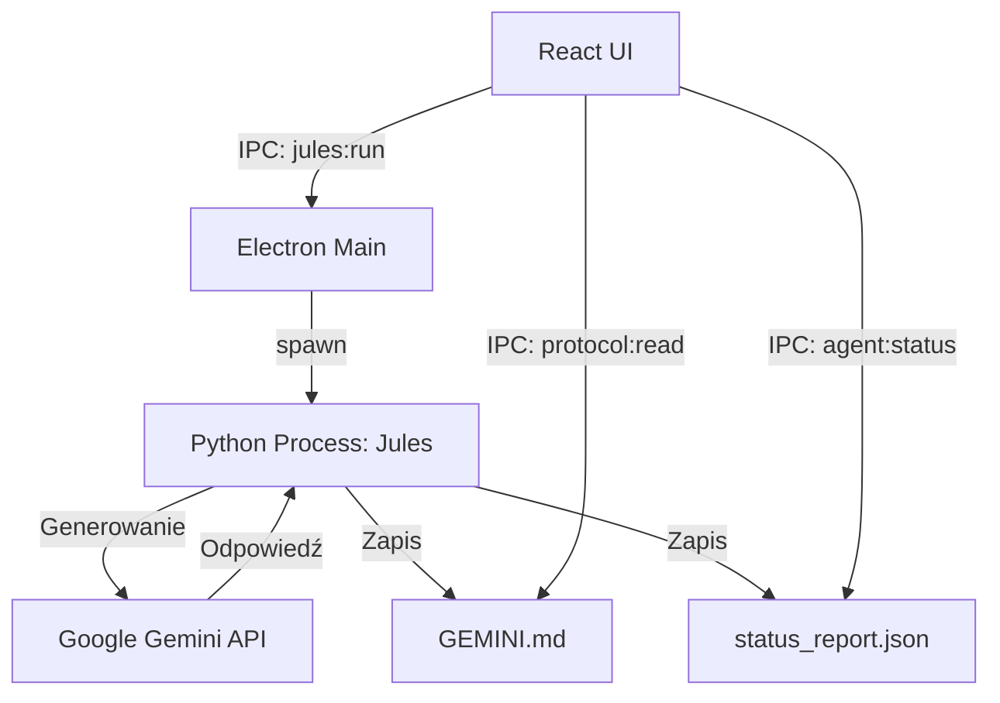

# Architektura Systemu Cyberdeck

## Przegląd
Projekt jest aplikacją hybrydową typu "Cyberdeck", łączącą nowoczesny frontend React (hostowany w Electron) z potężnym backendem opartym na Pythonie, wykorzystującym modele generatywne (Google Gemini).

### Główne Komponenty

1.  **Frontend (Electron + React)**
    - Odpowiedzialny za interfejs użytkownika (UI), edytor kodu, wizualizację statusu agentów.
    - Zbudowany na Vite, TailwindCSS i Monaco Editor.
    - Komunikuje się z warstwą Electrona poprzez bezpieczny most IPC (`window.api`).

2.  **Backend (Electron - Node.js)**
    - Zarządza oknem aplikacji i cyklem życia.
    - Pośredniczy w operacjach na plikach (odczyt/zapis protokołów).
    - Uruchamia procesy Pythona (`jules_cli.py`) na żądanie.

3.  **Agent Core (Python)**
    - **Regis**: Lokalny zarządca, "mózg" operacyjny.
    - **Jules**: Audytor i analityk, wykorzystujący technikę "Skeleton-of-Thought" i "Multi-Agent Debate".
    - Skrypty te działają jako niezależne procesy CLI, zwracając wyniki do Electrona lub zapisując je w plikach współdzielonych (`GEMINI.md`, `status_report.json`).

## Diagram Przepływu Danych

## Szczegóły Integracji

### Electron <-> Python
Aplikacja nie używa standardowego serwera HTTP (np. Flask/FastAPI) do komunikacji z Pythonem w czasie rzeczywistym. Zamiast tego stosuje model "Fire and Forget" z plikami pośredniczącymi (Sidecar Pattern):
1.  Electron uruchamia skrypt Pythona.
2.  Python wykonuje zadanie, aktualizując na bieżąco plik `status_report.json`.
3.  Frontend odpytuje (poll) ten plik, aby wyświetlić pasek postępu i logi ("Thinking process").
4.  Wynik końcowy ląduje w `GEMINI.md`, który jest następnie odczytywany przez frontend.

### Bezpieczeństwo
- **Context Isolation**: Włączone. Frontend nie ma bezpośredniego dostępu do Node.js.
- **IPC Allowlist**: `electron/main.ts` ściśle definiuje dozwolone kanały (`protocol:read`, `protocol:save`, `jules:run`).
- **File Access**: Ograniczony do katalogu roboczego projektu.

## Struktura Katalogów

- `/cyber-deck-protocol` - Kod źródłowy aplikacji Electron/React.
- `/docs` - Dokumentacja techniczna.
- `/` (Root) - Skrypty Python (`regis.py`, `jules.py`), konfiguracja środowiska, pliki wymiany danych.
